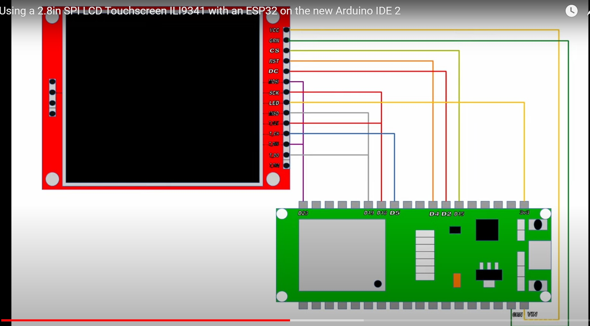

***
# 一、(TFT_eSPI与LVGL)库配置

***
## 1. TFT_eSPI安装后,设置User_Setup.h文件

### 1.1 驱动：第45行
```
#define ILI9341_DRIVER 
```

### 1.2 定义ESP32的TFT显示引脚：第212到217行
```
#define TFT_MISO 19
#define TFT_MOSI 23
#define TFT_SCLK 18
#define TFT_CS   15  // Chip select control pin
#define TFT_DC    2  // Data Command control pin
#define TFT_RST   4  // Reset pin (could connect to RST pin)
```
### 1.3 定义ESP32的触摸屏显示引脚：第230行
```
#define TOUCH_CS 21     // Chip select pin (T_CS) of touch screen
```
### 1.4 定义SPI频率：第364行

```
#define SPI_FREQUENCY  40000000
```
### 1.5 复制lv_conf_template.h到.pio/libdeps/esp32dev目录下, 并重命名为lv_conf.h
#### 1.5.1  第15行 ```#if 0```改为```#if 1```
#### 1.5.2  第233行 ```#define LV_USE_LOG 0```改为```#define LV_USE_LOG 1```
#### 1.5.3  设置字体大小为8个像素（可选）第390行 ```#define LV_FONT_MONTSERRAT_8  0```改为```#define LV_FONT_MONTSERRAT_8  1```

***
## 2. 或者直接在User_Setup_Select.h中修改，直接跳过第一步的1.1到1.4步

### 2.1 注释掉第24行：```#include <User_Setup.h> ```
### 2.2 选择已经预设好的配置文件，第76行：```#include <User_Setups/Setup42_ILI9341_ESP32.h>  ```
### 2.3 在Setup42_ILI9341_ESP32.h文件中，取消第14行的注释```#define TOUCH_CS 5 // Chip select pin (T_CS) of touch screen```,使触摸屏生效

*** 
## 二、SPI显示器与触屏连接图


***
# 三、其它配置(在main.cpp中)

***
## 1. 旋转配置

***
### 1.1 屏幕显示旋转180度方法一：
在```lv_disp_drv_register(&disp_drv)```加上如下语句;
```disp_drv.rotated = LV_DISP_ROT_180;```
***
### 1.2 屏幕显示旋转180度方法二：
把```tft.setRotation(3); /* Landscape orientation, flipped */```改成```tft.setRotation(1); /* Landscape orientation, flipped */```

***
## 2. 触摸屏坐标超范围 (lvgl 8.3.11, TFT_eSPI 2.5.43)
```
void my_touchpad_read(lv_indev_drv_t *indev_drv, lv_indev_data_t *data)
{
    uint16_t touchX, touchY;

    bool touched = tft.getTouch(&touchX, &touchY, 600);

    if (!touched)
    {
        data->state = LV_INDEV_STATE_REL; //
    }
    else
    {
        data->state = LV_INDEV_STATE_PR;

        /*Set the coordinates*/
        data->point.x = touchX; //改之前
        data->point.y = touchY; //改之前
        data->point.x = touchX * 4 / 3; //改之后
        data->point.y = touchY * 3 / 4; //改之后

        Serial.print("Data x ");
        Serial.println(touchX);

        Serial.print("Data y ");
        Serial.println(touchY);
    }
}
```
***
## 3. 触摸屏校准
把TFT_eSPI示例中的Generic -> Touch_calibrate上传到ESP32,通过点击触摸屏上的箭头来校准屏幕。并记下串口回传的下面的内容，并复制到main.cpp中。
```
    the Generic -> Touch_calibrate example from the TFT_eSPI library*/
    uint16_t calData[5] = {361, 3552, 254, 3570, 7};
    tft.setTouch(calData);
```

***
## 4. 移植LVGL
### 4.1 把squareline studio里导出的文件和文件夹放入src目录
### 4.2 把下列语句添加到main.cpp(这里的maincpp文件是从lvgl/examples/arduino/LVGL_Arduino/LVGL_Arduino.ino中复制过来的)
```#include <ui.h>```
### 4.3 把下列语句添加到main.cpp的loop()里
```ui_init();```
### 4.4 下面是可以上传到ESP32并运行的main.cpp
[程序](main.cpp)

***
## 5. LVGL创建的回调函数导入
### 5.1 LVGL创建的回调函数都在ui_events.h里声明，在ui_event.c中调用，只需要将ui_events.c中的函数剪切到main函数中即可。这样可以避免重新导出ui时被覆盖掉
### 5.2 形参的格式为（lv_event_t * e）,如下：

```
void onLEDCallback(lv_event_t * e)
{
	digitalWrite(LED_BUILTIN, HIGH);
}
```

## 6. Squareline Studio的修改label的TEXT属性的语句
```_ui_label_set_property(ui_dateLabel, _UI_LABEL_PROPERTY_TEXT, "Bigprogress");```