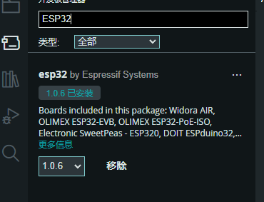

***
### 一台电脑上编译Arduino没问题，另一台电脑上编译后可以上传但无法运行，原因：ESP32开发板管理器中重新安装ESP32

***
### 在中断服务程序中，不能使用delay()函数和millis()函数。因为他们无法在中断服务程序中正常工作。
***
### 红外控制信号不能准确工作时，可以结合flag重复运行几次，比如fishfeeder2 3.0版本中的红外控制插座通常一次控制不能准确工作，在irSwitch（）函数里，循环检查状态并运行三次。
***
### ESP32 所有引脚输入电压为3.3V,最高为3.6V, 而Arduino Uno的引脚电压是5V，选用外设时须注意
***
#### 小车电机的霍尔编码器掉坑里了，电路板用5V，ESP32用3.3V，所以无法正常工作。
***
***
### ESP32 GPIO 12 (启动时必须为低电平), 在Air_Fresher项目中给GPIO12上的开关加了上拉电阻，导致```rst:0x10 (RTCWDT_RTC_RESET),boot:0x37 (SPI_FAST_FLASH_BOOT)```错误, 同样如果12脚连接的外设，也会导致上传程序出错而无法上传

### Preferences库中的，
#### 1. preferences.begin(“name”, false)中的第二个参数必须为false.否则NVS分区无法找到。
#### 2. preferences.clear()用来清除nvs分区中的所有数据。
#### 3. preferences.putString(“key”, “value”)用来存储字符串数据。
#### 4. preferences.getString(“key”, “value”)用来获取字符串数据。
#### 5. preferences.putInt(“key”, 123)用来存储整数数据。
#### 6. preferences.getInt(“key”, 123)用来获取整数数据。
#### 7. preferences.putBool(“key”, true)用来存储布尔值数据。
#### 8. 重新上传程序后不能清空nvs分区中的数据。要用preferences.clear()来清空nvs分区中的所有数据。

### 在ESP32使用SimpleFTPServer库的过程中，使用时要把FtpServerKey.h第63行的#define DEFAULT_STORAGE_TYPE_ESP32设置为STORAGE_SD。否则python无法访问ESP32的SD卡。

